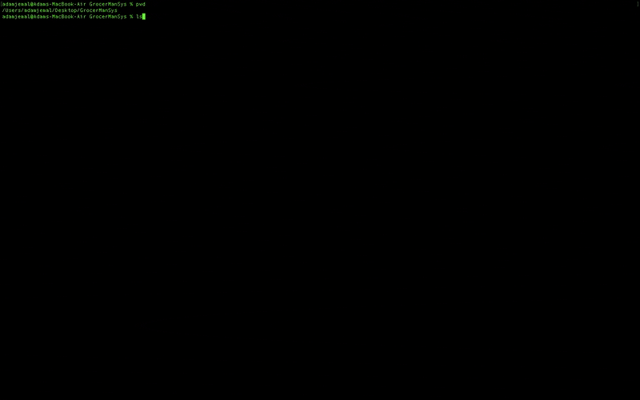

# Grocery Store Management System

This is a Grocery Store item management system I made using C. This system has two major features:

<ol>
<li>Stores and updates information of grocery's product inventory </li>
<li>Cash register for customers transactions</li>
</ol>

## Demo

## How it Works

  <b>Product Management Feature</b> 
<ul>
<li>Program allows you to enter current stock of item in the store, which it will save and update during the day.</li>
<li>Inventory is updated everytime a product is sold</li>
</ul>

  <b>Cashier Feature</b> 
<ul>
<li>It has a sales mode feature you can switch to which acts as a cash register for customers to purchase items. </li>
<li>Produces an receipt after a completed transaction for the customer</li>
<li>creates a summary of the sales, remaining inventory in stock and the top sellers in each category at the end of the day.</li>
<li>Products that fall under the house wares and miscellaneous categories are taxed at 13%. The other category products are exempt from this exception and are tax-free</li>
</ul>

## How the inventory was categorized

All products are identified by name, have a set price, ID and belong in one of the 7 categories:

<ol>
<li>produce</li>
<li>bakery</li>
<li>meat</li>
<li>dairy</li>
<li>baking</li>
<li>house wares</li>
<li>miscellaneous</li>
</ol>

## Technologies Used

<ul>
<li>
C
</li>
</ul>
